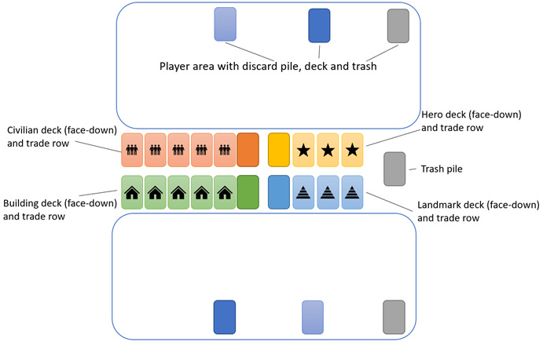

# Civ Builder

## Overview
Civ builder is a civilisation-themed deck-building game. Players will start with a 'basic' civilisation and the aim of the game is to grow that civilisation by acquiring new citizens and infrastructure. Players score victory points from the landmarks they build, and the player with the most victory points wins.

## Components
Civ builder consists of the following cards:
•	160 civilian cards
•	18 hero cards
•	88 building cards
•	15 landmark cards
•	4 basic building cards (with asterisk in name)
•	40 basic civilian cards (with asterisk in name)

## Card Overview

### Civilian Cards
```
+---+-------+---+
| 1 |   2   | 3 |
+---+-------+---+
|   |   4   |   |
|   |       |   |
+---+-------+---+
|   |       |   |
|   |   5   |   |
|   |       |   |
+---+-------+---+
|   |   6   | 7 |
+---+-------+---+
```

1. Civilian symbol. Indicates that card is a 'civilian' type card
2. Card name
3. Cost
4. Image
5. Card Description
6. Build value (if applicable). Indicates that the card can be used to build constructs
7. Person symbol. Indicates that card is a 'person' type card

### Hero Cards
```
+---+-------+---+
| 1 |   2   | 3 |
+---+-------+---+
|   |   4   |   |
|   |       |   |
+---+-------+---+
|   |       |   |
|   |   5   |   |
|   |       |   |
+---+-------+---+
|   |       | 6 |
+---+-------+---+
```

1. Hero symbol. Indicates that card is a 'hero' type card
2. Card name
3. Cost
4. Image
5. Card Description
7. Person symbol. Indicates that card is a 'person' type card

### Building Cards
```
+---+-------+---+
| 1 |   2   | 3 |
+---+-------+---+
|   |   4   |   |
|   |       |   |
+---+-------+---+
|   |       |   |
|   |   5   |   |
|   |       |   |
+---+-------+---+
| 6 |   7   | 8 |
+---+-------+---+
```

1. Building symbol. Indicates that card is a 'building' type card
2. Card name
3. Cost
4. Image
5. Card Description
6. Strength
7. Build cost. Indicates how much build value is required to build this card
8. Construct symbol. Indicates that card is a 'construct' type card

### Landmark Cards
```
+---+-------+---+
| 1 |   2   | 3 |
+---+-------+---+
|   |   4   |   |
|   |       |   |
+---+-------+---+
|   |       |   |
|   |   5   |   |
|   |       |   |
+---+-------+---+
| 6 |   7   | 8 |
+---+-------+---+
```

1. Landmark symbol. Indicates that card is a 'landmark' type card
2. Card name
3. Cost
4. Image
5. Card Description
6. Strength
7. Build cost. Indicates how much build value is required to build this card
8. Construct symbol. Indicates that card is a 'construct' type card

### Traits
Each card has one or more traits, indicated by its colour as well as the trait bar on the card. There are 3 traits, representing the core pillars of the game:
- Commerce: cards which provide money or build, and help you grow your civilisation by acquiring more cards and building constructs
- Culture: cards which provide research or trash, and help you improve your civilisation by drawing more card from your deck per turn, or removing low-value cards from your deck
- Conflict: cards which provide warfare or steal, and help you disrupt your opponents' civilisations by destroying their constructs and stealing their persons and constructs


## Setup
The basic type cards (starting cards) are the cards that form the players' setup. Basic Cards are identified by the asterisk in the name. Each player starts with a basic deck consisting of 8 ‘workers’, 1 ‘trader’ and 1 ‘builder’. Additionally, each player starts with a building card, ‘market’. 

Distribute the starting cards to each player. Any excess cards are removed from play. Each player takes their market and places it face-up in their play area. Each player then shuffles their remaining starting deck and places it face down in front of them in their play area. 

Sort the remaining cards into their 4 types (Civilian, Hero, Building, Landmark) according to symbol in top left corner. Shuffle the decks and arrange them in 4 face-down piles in centre of play area. 

Deal one random landmark card to each player. It goes face up in their play area, unbuilt (with the text upside-down). Remove cards from the Landmark and Hero decks so that the final deck size is according to the table below (removed cards are removed from game):

| No of players | Hero Deck | Landmark Deck |
| ------------- | --------- | ------------- |
| 2             | 12        | 11            | 
| 3             | 14        | 13            |
| 4             | 16        | 15            |

Place 5 cards from the civilian and building decks in a face-up row next to their respective decks. Place 3 cards from the hero and landmark decks in a face-up row next to their respective decks. These face up rows are the trade row for each deck.

Decide which player goes first. Each player draws five cards. This is their starting hand.



*Example setup*

## Gameplay
Play starts with the first player. In a two player game, play alternates between the players, with each player taking a turn and then play passing to the opponent. In a 3+ player game, play proceeds clockwise around the players. In a team game, players on the same team play simultaneously.

A player's turn consists of the following steps:

### Turn start
At the start of a player’s turn, they take any number of stored cards from their play area and add them to their hand. After this, no other stored cards can be moved from their play area to their hand for the rest of this turn. The effects of cards that are already in play (constructs) become active immediately. Then, the player spends their turn playing any of the cards from their hand in any order. When a card is played, the effect on that card becomes active until the end of the turn.

### Play phase
The player resolves the effects of all of the cards in their play area, which may include trade, build, research, warfare, steal, trash, discard & return. Each of these key terms is explained in more detail later. For each of these effects, a card may offer some value (e.g. 3 money towards trade). The value of many cards can be summed together, e.g. 3 money from card A, 2 money from card B gives 5 total for trade. The core effects listed above can be performed multiple times in any order during one turn, e.g spending 4 money on trade, then doing 5 damage of warfare and then spending another 3 money on trade. However, the value of a card can only be used once. Spending all 3 money from card A on the 4-money trade in the example above means card A can no longer be used this turn for the 3-money trade.

### Turn end
When a player has performed all of their desired effects, they end their turn. As they end their turn they discard any non-permanent cards from play, placing these cards into their discard pile. Then they draw 5 new cards to their hand. Finally, trash the card from the building trade row which is furthest from the deck, and the same for the civilian trade row.

## Card Types

### Person
Includes Civilians and Heroes. The Basic civilians (worker, trader & builder) are person type cards in addition to being basic type cards. When persons are played, their effects are immediately available.

### Civilians
A civilian card is non-permanent – at the end of turn it is discarded unless it is stored on a building or contributing to the construction of a building.

### Heroes
A hero card is limited – it can be used once, and then it is trashed. Each hero comes with 2 options – use & then trash, or discard for use on another turn.

### Construct
Includes Buildings and Landmarks. The Basic buildings (market) are Construct types in addition to being basic type cards. When constructs are played, their effects are not immediately available. Instead, they are played upside-down (face up, but with text facing opponent rather than owner) so that the building cost sits along the top of the card. While in this upside-down state, Construct cards and their effects are inactive, cannot be used and cannot be targeted by another player’s abilities, steal or warfare (unless explicitly stated otherwise). Person cards with build values are assigned to upside-down Construct cards. When the total build value of assigned Person cards equals or exceeds the building cost of the Construct card, the Person cards are discarded and the Construct card is flipped the right way up. Its effects are immediately active. 

### Buildings
A building card is permanent – it stays in the play area at the end of turn and its effects can be reactivated at the start of the next turn if it is still in the play area. When a building is destroyed, it goes to the discard pile of the player who owns it

### Landmarks
*The legacy of any great civilisation is preserved in the landmarks it leaves behind.*

A landmark card is permanent – it stays in the play area at the end of turn. Typically Landmarks have no active effects during the game, however most point scoring in the endgame is achieved through landmarks

## Card Effects

### Money
Purchase cards from any of the trade rows. The cost of cards is indicated in the top right hand corner. When you purchase a card, take it from the trade row and place it in your discard pile. Then, draw a new card from the corresponding deck and add it to the trade row.

### Build
The build value of a Person type card is shown along the bottom of the card. It is also described in the card's text. The card text description indicates how much build value that person card can use, and the value along the bottom indicates how much it contributes to the build (these are technically the same thing. The notation in the text is to help identify if the effect is in addition to or instead of the other effects granted by the card. The value on the bottom is as a reminder when the person card is assigned to a construct). Persons with build (worker) value can be assigned to constructs under construction by tucking the person card face-up but upside-down (text facing away from player) underneath the construct card, so that the build value of the person card sits above the build cost of the construct card. The total build value of the person is contributed toward the total value needed to construct the building.

### Research
Research allows the player to draw a number of cards from their deck equal to the research value on the card.

### Warfare
The warfare value from across the cards in a player’s play area during the turn (from played cards and cards which were already in play) is summed together. This gives a total warfare value, which is used to discard building cards from an opponent’s play area. The strength of a building indicates the required warfare to discard it. If player A has warfare value of 7, this could destroy player B’s building of value 4 and building of value 3, but then the 7 is used up so none is left to destroy remaining buildings owned by player B. Unless cards instruct otherwise, the attacking player decides which buildings to target with their warfare.

### Steal
During a player’s turn, they can steal cards from an opponent. Unless otherwise specified, Steal targets cards in an opponent’s discard pile. When a card is stolen, it is placed into the discard pile of the player who stole it. The steal value of a card indicates the maximum cost of the target card, i.e. a card with 3 Steal can steal a card costing up to 3. The steal value of multiple cards can be combined together to steal a larger value card, but each card with Steal can only contribute to stealing one other card per round, even if it has excess remaining Steal value.

### Store
If a building card has a store value, at the end of a player’s turn they can tuck person cards from play or hand under the building instead of discarding them. The building card will specify the quantity/value of cards which can be stored in total and per turn, and what kind of cards can be tucked. Importantly, the tucked cards can only be of a *single* trait, and that trait must match one of the traits of the building. Stored cards can then be added to the player’s hand at the start of that player’s next turn, in addition to the cards they had already drawn from the end of the previous turn. If the building with stored cards is discarded or trashed (e.g. due to opponent’s warfare) then the stored cards are discarded.

### Trash
The card to be trashed is placed in a separate trash pile (there is a trash pile for each player, as well as for the trade rows). Trashed cards are not returned to a player’s discard, hand or play area, effectively meaning they are un-usable for the rest of the game. If a card is trashed from a player’s hand, discard or play area it goes to that player’s trash. If it is trashed from a trade row, it goes to the trade row trash.

### Discard
When a card is discarded, it is put in the owner’s discard pile. Discard effects will specify what cards can be targeted by discard. It may be your own cards in play or hand, or your opponent’s cards (in play or hand).

### Passive
Many buildings will have unique passive effects. These are triggered at the start of every turn where they are present in the player’s play area. It can be useful to ‘tap’ the building to indicate when its passive effect has been used.


